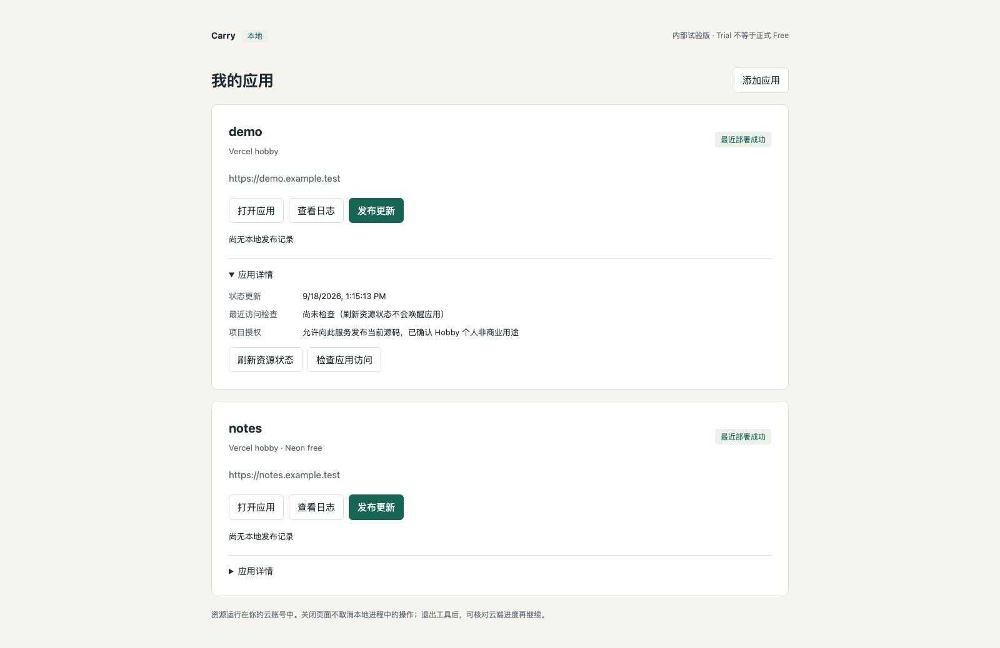

# Carry

A skill for Codex and Claude Code. Tell your agent to deploy, check, and update an app that already lives in **your** Vercel or Railway account. Neon is optional. Carry runs on your machine; there is no hosted backend.

After setup, start a new chat and type `$carry` (Codex) or `/carry` (Claude Code). Then:

> Use Carry. Log into my Vercel account, attach this existing app as `demo`, check the plan, and deploy. Connect Neon only if this app needs it. Keep existing Secrets. Tell me when I need to approve a browser login.

Do not paste tokens. If you only have code and no cloud app yet, the agent should stop — this alpha cannot create cloud resources.

**[Get started](https://github.com/unix2dos/carry/blob/main/docs/FIRST-TRY.md)** — install, current limits (macOS Apple Silicon, existing Vercel Hobby app; Neon optional), and the first deploy.

[Alpha notes](docs/ALPHA.md) · [Product scope](PRODUCT.md) · [License](LICENSE)
